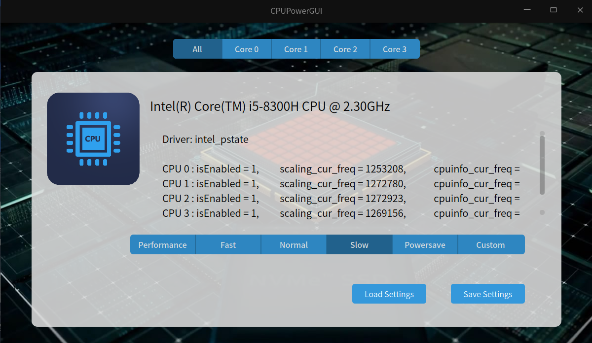
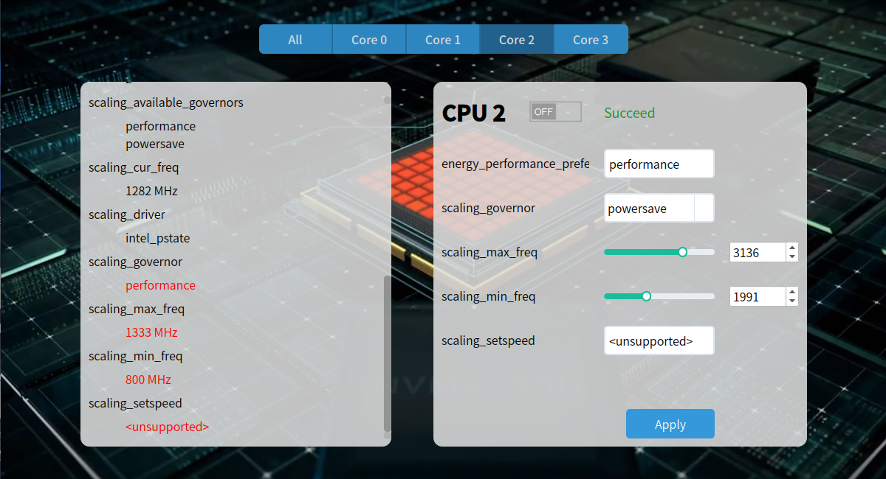

## CPUPowerGUI


CPUPowerGUI is a CPU frequency scaling tool for Linux with graphical user interface. It create a mapping between the kernel information in /sys/devices/system/cpu/* and UI elements.  This program uses C++ and Qt5 Framework.  


Feature:  

+ Change all cores' frequency to pre-defined value. 
+ Turn on or off a single cpu core.
+ View details of CPU cores.
+ Modify values of available CPU options.


## ScreenShot







## Install

For Debian based distros, download released CPUPowerGUI deb package and install it.   

For other distros, compile the program and run the executable file as root user.  

```bash
mkdir build && cd build
qmake ..
make -j4
sudo ./CPUPowerGUI
```

## Documents

doc/OOAD.docx is Chinese document of Object-oriented analysis and design of this software.

Here are some useful documents about CPU frequency in Linux OS.

https://www.kernel.org/doc/Documentation/cputopology.txt   
https://www.kernel.org/doc/Documentation/cpu-freq/user-guide.txt   
https://www.kernel.org/doc/html/v4.14/admin-guide/pm/cpufreq.html   
